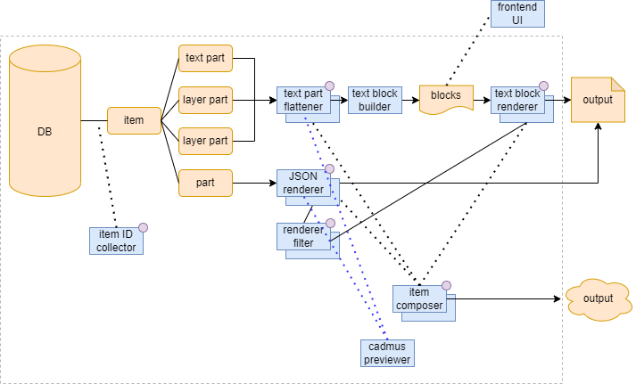

# Overview

- [Overview](#overview)
  - [Generic Preview](#generic-preview)
    - [Renderer Filters](#renderer-filters)
      - [Thesaurus Lookup Filter](#thesaurus-lookup-filter)
      - [Markdown Conversion Filter](#markdown-conversion-filter)
      - [Text Replacements Filter](#text-replacements-filter)
      - [Fragment Link Filter](#fragment-link-filter)
  - [Specialized Preview](#specialized-preview)
  - [Higher Level Components](#higher-level-components)
  - [Configuration](#configuration)
  - [JSON Rendering](#json-rendering)

The main components of the Cadmus preview architecture are summarized in Figure 1:



- _Figure 1: Cadmus preview architecture_

It all starts from the Cadmus **database**, including items with their parts. Some of these parts may represent text (with a text part) or layered text (with a text part and any number of text layer parts). Many other parts may well represent non-textual data (e.g. the codicological description of a manuscript).

As for preview, the main distinction is between a **generic preview**, which can be applied to any part; and a **specialized preview** specifically designed for layered texts.

## Generic Preview

The _generic_ preview relies on some **JSON renderer** component. A JSON renderer component is just a component which takes JSON (representing any Cadmus data object: part, fragment, or item), and renders it into some text-based format, like HTML, XML, etc.

In Figure 1, you can see that a JSON renderer picked from a set of available renderers can be used to produce some text-based output from a Cadmus part, whatever its type.

To this end, the JSON renderer may also use a set of **renderer filters**. Such filters are executed in the order they are defined for each renderer, just after its rendition completes. Each filter has a specific task, often general enough to be reused in other renderers.

For instance, some prebuilt filters allow you to lookup thesauri (resolving their IDs into values), convert Markdown text into HTML or plain text, perform text replacements (either based on literals, and on regular expressions), or resolve the mapping between layer IDs and target IDs in text.

### Renderer Filters

Cadmus provides some builtin filters, but as for any other component type you are free to add your own. The filters to be used are typically specified in a JSON-based configuration, where each filter type has its own ID. Here I list the builtin filters.

#### Thesaurus Lookup Filter

Lookup any thesaurus entry by its ID, replacing it with its value when found, or with the entry ID when not found.

- ID: `it.vedph.renderer-filter.mongo-thesaurus`
- options:
  - `ConnectionString`: connection string to the Mongo DB. This is usually omitted and supplied by the client code from its own application settings.
  - `Pattern`: the regular expression pattern representing a thesaurus ID to lookup: it is assumed that this expression has two named captures, `t` for the thesaurus ID, and `e` for its entry ID. The default pattern is a `$` followed by the thesaurus ID, `:`, and the entry ID.

#### Markdown Conversion Filter

Convert Markdown text into HTML or plain text.

- ID: `it.vedph.renderer-filter.markdown`
- options:
  - `MarkdownOpen`: the markdown region opening tag. When not set, it is assumed that the whole text is Markdown.
  - `MarkdownClose`: the markdown region closing tag. When not set, it is assumed that the whole text is Markdown.
  - `Format`: the Markdown regions target format: if not specified, nothing is done; if `txt`, any Markdown region is converted into plain text; if `html`, any Markdown region is converted into HTML.

#### Text Replacements Filter

Perform any text replacements, either literals or based on regular expressions.

- ID: `it.vedph.renderer-filter.replace`
- options:
  - `Replacements`: an array of objects with these properties:
    - `Source`: the text or pattern to find.
    - `Target`: the replacement.
    - `Repetitions`: the max repetitions count, or 0 for no limit (=keep replacing until no more changes).
    - `IsPattern`: `true` if `Source` is a regular expression pattern rather than a literal.

#### Fragment Link Filter

Map layer keys into target IDs, leveraging the metadata built by the text renderer run before this filter. This is used to link fragments renditions to their base text (see about [building TEI](markup.md) for more).

- ID: `it.vedph.renderer-filter.fr-link`
- options:
  - `TagOpen`: the opening tag for fragment key.
  - `TagClose`: the closing tag for fragment key.

## Specialized Preview

The _specialized preview_ is for layered text parts.

As you can see from Figure 1, this preview uses a number of components:

- some **text part flattener** (`ITextPartFlattener`) is used to flatten a layered text (i.e. one text part plus any number of text layer parts) into a set of _text blocks_. Each text block is a span of text with a number of layer IDs, linking that text with its annotations from layers. This is also the input model for a related HTML visualization leveraging [this brick](https://github.com/vedph/cadmus-bricks-shell/tree/master/projects/myrmidon/cadmus-text-block-view). Once the text and its layers are flattened, blocks are built using logic shared among all the flatteners (implemented in `TextBlockBuilder`). So, while the flattening logic varies according to the type of the text part (e.g. `TokenTextPart` or `TiledTextPart`), the block building logic stays the same. The resulting blocks are an abstraction, which can be easily leveraged in an interactive UI, as well as represent the source for building some other output like TEI.

- some **text block renderer** can be used to generate a text-based output from these blocks. For instance, you can use a TEI block renderer to build TEI from text blocks.

## Higher Level Components

Higher level components can be used to orchestrate the tasks performed by these various components.

The **item composer** is a configurable component designed to compose the renditions from the parts belonging to a single item. Here you are free to add your own composers with any complex logic. The output of a composer is not limited in any way; for instance, the builtin TEI composer writes a set of TEI documents with stand-off notation.

The **Cadmus previewer** is the surface component used by Cadmus API. This allows rendering a part, a layer part's fragment, and eventually even an item (via an item composer).

## Configuration

The Cadmus previewer relies on a JSON configuration consumed by a factory (`CadmusPreviewerFactory`), having these sections, all modeled as arrays of objects:

- `RendererFilters`: a set of configured renderer filters, each grouped under an arbitrary key. These filters can then be referenced by their key from other sections.
- `JsonRenderers`: a set of JSON renderers, each grouped under an arbitrary key. The key corresponds to the part type ID, eventually followed by `|` and its role ID in the case of a layer part. This allows mapping each part type to a specific renderer ID.
- `TextPartFlatteners`: a set of text part flatteners, each grouped under an arbitrary key as above for `JsonRenderers`. These are in charge of flattening the text of a base text part, which is a stage in building its block-based representation.
- `TextBlockRenderers`: a set of text block renderers, used to produce some text output starting from text blocks. These can be used when exporting a layered text into some other format, e.g. XML TEI.
- `ItemComposers`: a set of item composers, used to produce any type of output starting from an item with its parts.

Each array in the configuration contains any number of JSON objects having:

- an `Id` property.
- an optional `Options` object to configure the component. All the `JsonRenderers` can have a `FilterKeys` array property, specifying the filters to apply after its rendition. Each entry in the array is one of the filters keys as defined in the `RendererFilters` section.
- a `Keys` property is used to include the key of the object type being processed.

As a sample, consider this configuration:

- 3 renderer filters are defined with their keys: `thes-filter`, `rep-filter`, `md-filter`.
- 3 renderers are defined for 3 different part types (a base text part, and two layer parts). The JSON renderer here is just a "null" renderer which passes back the received JSON, for diagnostic purposes; but any other renderer can be used and configured via its `Options` property.
- 1 text part flattener is defined for the token-based text part type.
- 1 text block renderer is defined to produce simple TEI from a layered text.
- 1 item composer is defined for a file-based TEI stand-off output, using a specific text part flattener and text block renderer, plus a number of JSON renderers, one for each layer part type.

```json
{
  "RendererFilters": [
    {
      "Keys": "thes-filter",
      "Id": "it.vedph.renderer-filter.mongo-thesaurus"
    },
    {
      "Keys": "rep-filter",
      "Id": "it.vedph.renderer-filter.replace",
      "Options": {
        "Replacements": [
          {
            "Source": "hello",
            "Target": "HELLO"
          }
        ]
      }
    },
    {
      "Keys": "md-filter",
      "Id": "it.vedph.renderer-filter.markdown",
      "Options": {
        "MarkdownOpen": "<_md>",
        "MarkdownClose": "</_md>",
        "Format": "txt"
      }
    }
  ],
  "JsonRenderers": [
    {
      "Keys": "it.vedph.token-text",
      "Id": "it.vedph.json-renderer.null",
      "Options": {
        "FilterKeys": [
          "thes-filter",
          "rep-filter",
          "md-filter"
        ]
      }
    },
    {
      "Keys": "it.vedph.token-text-layer|fr.it.vedph.comment",
      "Id": "it.vedph.json-renderer.null"
    },
    {
      "Keys": "it.vedph.token-text-layer|fr.it.vedph.orthography",
      "Id": "it.vedph.json-renderer.null"
    }
  ],
  "TextPartFlatteners": [
    {
      "Keys": "it.vedph.token-text",
      "Id": "it.vedph.text-flattener.token"
    }
  ],
  "TextBlockRenderers": [
    {
      "Id": "it.vedph.text-block-renderer.simple-tei",
      "Options": {
        "RowElement": "div",
        "BlockElement": "seg"
      }
    }
  ],
  "ItemComposers": [
    {
      "Keys": "text-item",
      "Id": "it.vedph.item-composer.tei-standoff.fs",
      "Options": {
        "TextPartFlattener": {
          "Keys": "it.vedph.token-text",
          "Id": "it.vedph.text-flattener.token"
        },
        "TextBlockRenderer": {
          "Id": "it.vedph.text-block-renderer.tei-standoff",
          "Options": {
            "RowElement": "div",
            "BlockElement": "seg"
          }
        },
        "JsonRenderers": [
          {
            "Keys": "it.vedph.token-text-layer|fr.it.vedph.comment",
            "Id": "it.vedph.json-renderer.null"
          },
          {
            "Keys": "it.vedph.token-text-layer|fr.it.vedph.orthography",
            "Id": "it.vedph.json-renderer.null"
          }
        ]
      }
    }
  ]
}
```

## JSON Rendering

Any Cadmus object, either part or fragment, is ultimately archived as JSON. So, JSON is the starting point when rendering the output. Any component implementing `IJsonRenderer` can be registered in the previewer factory and used in the rendering configuration, with all its settings.

In most cases, unless complex logic is required, you can use the `XsltJsonRenderer`, which was designed with some essential requirements in mind:

- it should be fully customizable by users, who are accustomed to XSLT transformations. We must then adapt our JSON data to XML, so that it can be processed via XSLT.
- it should provide a powerful way for transforming JSON data even before submitting it to the XSLT processor. This refers to a true JSON transform, rather than a raw string-based transform, just like XSLT implies a DOM rather than just working on a sequence of characters.
- both the JSON and the XML transformation should be available in any combination: JSON only, XML only, JSON + XML.
- it should be able to convert Markdown text.
- it should be able to lookup thesauri.

To this end we leverage these technologies:

- [JMESPath](https://jmespath.org/tutorial.html), a powerful selection and transformation language for JSON.
- an automatic [conversion](https://www.newtonsoft.com/json/help/html/ConvertingJSONandXML.htm) from JSON to XML.
- XSLT for transforming XML.
- [Markdig](https://github.com/xoofx/markdig) to eventually convert Markdown regions into HTML/plain text.

Thesaurus lookup and Markdown conversion are provided via filters.

Additionally, the XSLT renderer can also inject properties into layer part fragments during JSON preprocessing, thus providing layer keys to be later used to link fragments to text blocks.

Even though this implies more processing stages, it represents a highly customizable component where most users will be at home, as XSLT is a popular and easy way of processing XML for output. Yet, eventually the additional processing power of a specific JSON transformation engine can be leveraged to prepare the data before converting them into XSLT. It might also be the case that there is no XSLT, and the output is directly generated by JMESPath transforms: in this case no conversion from JSON to XML will occur.

Also, more specialized processing is available via filters, which can extend any transformation.

As a sample, say we have this token-based text part, representing the text `que bixit / annos XX`:

```json
{
  "citation": "CIL 1,23",
  "lines": [
    { "y": 1, "text": "que bixit" },
    { "y": 2, "text": "annos XX" }
  ],
  "id": "9a801c84-0c93-4074-b071-9f4f9885ba66",
  "itemId": "item",
  "typeId": "it.vedph.token-text",
  "roleId": "base-text",
  "thesaurusScope": null,
  "timeCreated": "2022-08-07T14:04:01.3995195Z",
  "creatorId": "zeus",
  "timeModified": "2022-08-07T14:04:01.3995195Z",
  "userId": "zeus"
}
```

When handling it in a `XsltJsonRenderer` configured for a single XSLT-based transformation, first the JSON code is wrapped in a `root` element to ensure it is well-formed for XML conversion, whence:

```json
{
  "root": {
    "citation": "CIL 1,23",
    "lines": [
      { "y": 1, "text": "que bixit" },
      { "y": 2, "text": "annos XX" }
    ],
    "id": "9a801c84-0c93-4074-b071-9f4f9885ba66",
    "itemId": "item",
    "typeId": "it.vedph.token-text",
    "roleId": "base-text",
    "thesaurusScope": null,
    "timeCreated": "2022-08-07T14:04:01.3995195Z",
    "creatorId": "zeus",
    "timeModified": "2022-08-07T14:04:01.3995195Z",
    "userId": "zeus"
  }
}
```

Then, JSON is converted into XML:

```xml
<root><citation>CIL 1,23</citation><lines><y>1</y><text>que bixit</text></lines><lines><y>2</y><text>annos XX</text></lines><id>9a801c84-0c93-4074-b071-9f4f9885ba66</id><itemId>item</itemId><typeId>it.vedph.token-text</typeId><roleId>base-text</roleId><thesaurusScope /><timeCreated>2022-08-07T14:12:44.8640749Z</timeCreated><creatorId>zeus</creatorId><timeModified>2022-08-07T14:12:44.8640749Z</timeModified><userId>zeus</userId></root>
```

At this stage, the XSLT transformation occurs. In this example, it's a simple transform to produce a plain text output:

```xml
<?xml version="1.0" encoding="UTF-8"?>
<xsl:stylesheet xmlns:xsl="http://www.w3.org/1999/XSL/Transform" xmlns:tei="http://www.tei-c.org/ns/1.0" version="1.0">
  <xsl:output method="text" encoding="UTF-8"/>
  <xsl:strip-space elements="*" />

  <xsl:template match="citation">[<xsl:value-of select="."/>]<xsl:text xml:space="preserve">&#xA;</xsl:text>
</xsl:template>

  <xsl:template match="lines">
    <xsl:value-of select="y"/>
    <xsl:text xml:space="preserve">  </xsl:text>
    <xsl:value-of select="text"/>
    <xsl:text xml:space="preserve">&#xA;</xsl:text>
  </xsl:template>

  <xsl:template match="root">
    <xsl:apply-templates/>
  </xsl:template>

  <xsl:template match="*"></xsl:template>
</xsl:stylesheet>
```

So, the final output is:

```txt
[CIL 1,23]
1  que bixit
2  annos XX
```
